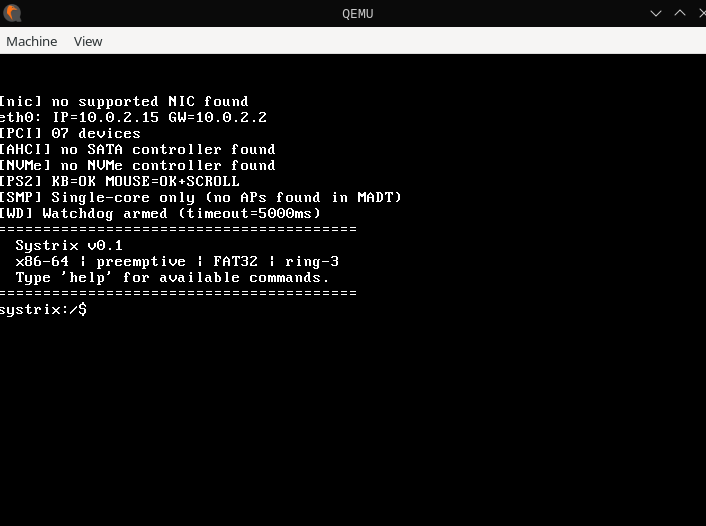

# SystrixOS

A bare-metal x86-64 operating system written in C and assembly. Boots from a custom 512-byte MBR bootloader, runs a monolithic kernel with a full network stack, VFS, process scheduler, and a built-in interactive shell — all without Linux underneath.



---

## Status

| Subsystem | Status |
|-----------|--------|
| Boot (MBR → long mode → kernel) | ✅ Working |
| VGA text terminal + shell | ✅ Working |
| Memory (PMM, VMM, heap, swap) | ✅ Working |
| FAT32 + VFS + JFS | ✅ Working |
| Processes (fork, exec, scheduler, signals) | ✅ Working |
| IPC, pipes, futexes | ✅ Working |
| PS/2 keyboard + mouse | ✅ Working |
| USB HID, AHCI, NVMe, PCI, ACPI | ✅ Working |
| SoundBlaster 16 | ✅ Working |
| Network (e1000, Ethernet, ARP, IP, DHCP, TCP) | ⚠️ Partial — DNS broken |
| GUI / framebuffer compositor | ❌ Not working |
| SystrixLynx browser | ❌ Not working (depends on network + GUI) |

---

## Features

- **Custom bootloader** — hand-written 512-byte MBR in x86 assembly
- **64-bit kernel** — monolithic, C + assembly stubs for interrupts and context switches
- **Memory management** — PMM (bitmap), VMM (4-level paging), heap, swap, memory safety
- **Filesystem** — FAT32 driver + JFS journaling on a VFS abstraction layer
- **Processes** — ELF64 loader, fork/exec, scheduler (round-robin), signals, futexes, pipes, IPC
- **Network stack** — e1000 NIC → Ethernet/ARP → IPv4/ICMP → UDP/TCP → DHCP (DNS in progress)
- **Shell** — interactive shell with variables, I/O redirection, ~30 built-in commands
- **Drivers** — PS/2 keyboard/mouse, USB HID, SoundBlaster 16, AHCI SATA, NVMe, PCI, ACPI

---

## Project Structure

```
SystrixOS/
├── boot/               # MBR bootloader (x86 assembly)
├── kernel/             # Kernel subsystems and drivers
├── include/            # Shared kernel headers
├── libc/               # Unified C library (kernel + user builds)
├── user/               # User-space runtime: libc, crt0, headers
├── browser/            # SystrixLynx — text-mode HTTP browser (not working yet)
├── examples/c/         # Example C programs
├── home/               # Files synced into the OS filesystem at boot
├── docs/               # Documentation
├── assets/             # Screenshots and logo
├── Makefile
├── linker.ld           # Kernel linker script
└── LICENSE
```

---

## Quick Start

**Requirements:** `gcc`, `binutils`, `mtools`, `qemu-system-x86_64`

```bash
make          # build systrix.img
make run      # launch in QEMU
make run-quiet  # launch silently (GTK window)
```

**Build and run a user program:**

```bash
make hello                    # build examples/c/hello.c → HELLO_C
make addprog PROG=HELLO_C    # embed it in the disk image
make run                      # boot, then: elf HELLO_C
```

**Sync files from `home/` into the OS filesystem:**

```bash
make synchome && make run
```

---

## Shell Commands

| Category | Commands |
|----------|----------|
| Files    | `ls`, `cat`, `write`, `append`, `touch`, `rm`, `cp`, `rename`, `mktxt` |
| System   | `uname`, `meminfo`, `uptime`, `ps`, `clear`, `reboot`, `halt` |
| Programs | `elf <file>` — run an ELF binary |
| Network  | `ping`, `dhcp`, `http` |
| Other    | `whoami`, `logout`, `ipc` |

> FAT32 filenames are **uppercase 8.3**. Use `elf HELLO_C`, not `elf hello_c`.

---

## Building User Programs

```bash
as  --64 -o user/crt0.o user/crt0.S
gcc -m64 -O2 -ffreestanding -fno-stack-protector -mno-red-zone \
    -nostdlib -nostdinc -Iuser \
    -c -o myprog.o examples/c/myprogram.c
ld  -m elf_x86_64 -static -nostdlib -Ttext=0x400000 \
    -o MYPROG user/crt0.o user/libc.o myprog.o
make addprog PROG=MYPROG
```

---

## License

See [LICENSE](LICENSE).
